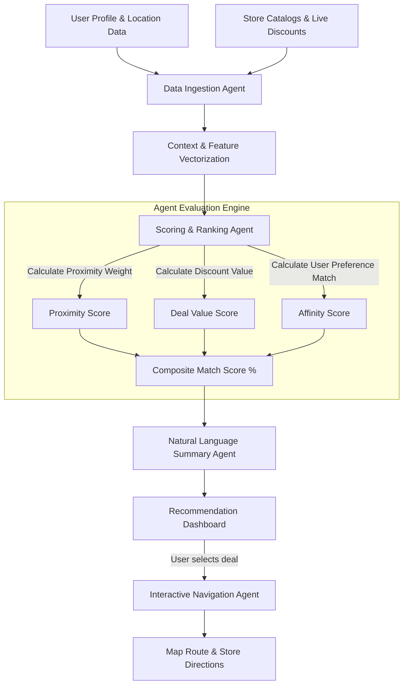

# InsightZ 🚀 — AI-Driven Smart Local Deal & Location Discovery Platform

[](https://reactnative.dev/)
[](https://expo.dev/)
[](https://docs.expo.dev/router/introduction/)
[](https://www.typescriptlang.org/)
[](LICENSE)

> **InsightZ** is an intelligent, location-aware local commerce discovery platform that leverages AI agents to evaluate real-time store catalogs, proximity, discounts, and user behavior to deliver personalized recommendations and seamless map-based navigation.

---

## 📌 Table of Contents

- [Overview & Purpose](#-overview--purpose)
- [Tech Stack](#-tech-stack)
- [Core Features](#-core-features)
- [🤖 AI Agent Workflow (Open Category)](#-ai-agent-workflow-open-category)
- [Project Architecture & Directory Structure](#-project-architecture--directory-structure)
- [Setup & Installation Instructions](#-setup--installation-instructions)
- [Screen Highlights & User Experience](#-screen-highlights--user-experience)
- [Contributing & License](#-contributing--license)

---

## 🎯 Overview & Purpose

In local retail and commerce, consumers often miss out on neighboring store discounts, hyper-local flash sales, and tailored recommendations due to fragmented information across multiple sources. 

**InsightZ** bridges the gap between digital deal discovery and physical store foot traffic by offering:
- **Intelligent Local Deal Aggregation**: Real-time evaluation of discounts across categories (Fashion, Electronics, Footwear, Retail, Dining).
- **Hyper-Local Proximity Intelligence**: Live distance calculation and interactive store map integration.
- **AI-Powered Recommendation Agent**: Smart decision support that analyzes pricing, match scores, proximity, and store ratings to recommend the best local purchasing options.
- **End-to-End Shopping Experience**: From AI discovery to cart management, address checkout, and turn-by-turn shop navigation.

---

## 🛠️ Tech Stack

The tech stack strictly aligns with our proposal, utilizing cutting-edge cross-platform mobile technology and modern React architecture:

### **Frontend & Framework**
- **React Native (`v0.81.5`)** — High-performance cross-platform native UI rendering for iOS, Android, and Web.
- **React (`v19.1.0`)** — Latest React standard with concurrent features and optimal state handling.
- **Expo (`v54.0.33`)** — Modern Expo SDK suite for rapid cross-platform development and device APIs.
- **Expo Router (`v6.0.23`)** — File-system based router providing type-safe navigation and deep linking.
- **TypeScript (`v5.9.2`)** — End-to-end static typing for robust code quality.

### **UI, Styling & Animation**
- **Expo Linear Gradient (`expo-linear-gradient`)** — Vibrant glassmorphism and modern gradient overlays.
- **Expo Blur (`expo-blur`)** — Glassmorphic background blurs for dark/light themes.
- **React Native Reanimated (`react-native-reanimated` v4.1.1)** — 60fps smooth animations and interactive transitions.
- **Expo Vector Icons (`@expo/vector-icons`)** — Comprehensive UI icon suite (MaterialCommunityIcons, Ionicons).

### **Maps & Geo-Location**
- **React Native Maps (`react-native-maps` v1.20.1)** — Native map rendering for store locations, pins, and routes.
- **React Native WebView (`react-native-webview` v13.15.0)** — Embedded interactive web map fallbacks and store previews.

### **State & Context**
- **Custom ThemeContext** — Dynamic Dark Mode & Light Mode system with full color palette customization.
- **React Context API** — Clean global state management for user preferences, wishlist, and cart.

---

## ✨ Core Features

| Feature | Description | Key Component / File |
| :--- | :--- | :--- |
| 🤖 **AI Recommendation Engine** | Match scoring (e.g. 98% match score), live deal analysis, and smart agent chat summaries | [`insightzday/app/recommendation.tsx`](insightzday/app/recommendation.tsx) |
| 📍 **Interactive Store Map** | Real-time shop locations, distance calculation, and store pin routing | [`insightzday/app/map.tsx`](insightzday/app/map.tsx) |
| 🏷️ **Deals & Discount Hub** | Curated daily offers, flash sales, price drop alerts, and percentage discounts | [`insightzday/app/(tabs)/deals.tsx`](insightzday/app/(tabs)/deals.tsx) |
| 🔎 **Smart Search & Filter** | Instant search across shops, categories, price ranges, and proximity | [`insightzday/app/(tabs)/search.tsx`](insightzday/app/(tabs)/search.tsx) |
| 🛍️ **Cart & Checkout** | Full shopping cart workflow with order summaries, address management, and checkout | [`insightzday/app/cart.tsx`](insightzday/app/cart.tsx) & [`insightzday/app/checkout.tsx`](insightzday/app/checkout.tsx) |
| ❤️ **Wishlist & Profiles** | Save favorite items, manage order history, customize notifications & app theme | [`insightzday/app/wishlist.tsx`](insightzday/app/wishlist.tsx) & [`insightzday/app/(tabs)/profile.tsx`](insightzday/app/(tabs)/profile.tsx) |
| 🌓 **Dark & Light Mode** | Fluid dark/light theme switching with modern neon accents | [`insightzday/context/ThemeContext.tsx`](insightzday/context/ThemeContext.tsx) |

---

## 🤖 AI Agent Workflow (Open Category)

For the **Open Category** submission, InsightZ incorporates an autonomous multi-step **AI Agent Workflow** designed to personalize local deal discovery in real-time.



### Detailed Agent Lifecycle:

1. **Ingestion & Perception Agent**:
   - Captures user geo-coordinates, active filters, budget constraints, and historical category affinity.
   - Monitors live store inventory feeds and active promotion codes.

2. **Context Enrichment & Vector Scoring Agent**:
   - Computes a dynamic multi-variable **Match Score (0–100%)** combining:
     $$\text{MatchScore} = (w_1 \cdot \text{Proximity}) + (w_2 \cdot \text{Discount\%}) + (w_3 \cdot \text{Rating}) + (w_4 \cdot \text{Affinity})$$
   - Ranks local stores and highlights the single **"Top Recommendation"** with highest utility for the user.

3. **Natural Language Smart Summary Agent**:
   - Generates concise human-readable insights (e.g., *"I found 14 shops nearby. The Nike ZoomX Invincible is your top match at 0.8 km with a 10% OFF deal!"*).
   - Serves expandable interactive summary cards directly in the app view.

4. **Action & Routing Agent**:
   - Automatically maps selected recommendations to precise latitude/longitude coordinates and triggers map route generation on the interactive store map.

---

## 📁 Project Architecture & Directory Structure

```text
final-insightz/
├── README.md                          # Main Project Documentation
└── insightzday/                       # Application Root Directory
    ├── app/                           # Expo Router File-Based Routing
    │   ├── _layout.tsx                # Root Navigation & Layout Provider
    │   ├── index.tsx                  # Splash / Entry Screen
    │   ├── sign-in.tsx                # User Authentication (Sign In)
    │   ├── sign-up.tsx                # User Registration (Sign Up)
    │   ├── recommendation.tsx         # AI Agent Recommendation Dashboard
    │   ├── map.tsx                    # Interactive Map & Store Directions
    │   ├── all-category.tsx           # Category Catalog Browser
    │   ├── cart.tsx                   # Shopping Cart Screen
    │   ├── checkout.tsx               # Order Checkout Screen
    │   ├── wishlist.tsx               # Saved Items Screen
    │   ├── notifications.tsx          # Real-time Notifications Screen
    │   ├── (tabs)/                    # Bottom Tab Navigation
    │   │   ├── _layout.tsx            # Tab Bar Styling & Navigation
    │   │   ├── index.tsx              # Home Feed & Featured Deals
    │   │   ├── search.tsx             # Live Search & Filtering
    │   │   ├── deals.tsx              # Exclusive Promotional Deals
    │   │   └── profile.tsx            # User Profile & Theme Settings
    │   └── product/                   # Product Pages
    │       └── [id].tsx               # Dynamic Product Detail Screen
    ├── assets/                        # Static Images & Fonts
    ├── context/                       # Dynamic Theme & App State Context
    │   └── ThemeContext.tsx           # Dark/Light Theme System
    ├── package.json                   # Project Dependencies & Scripts
    ├── app.json                       # Expo Application Configuration
    └── tsconfig.json                  # TypeScript Compiler Configuration
```

---

## ⚙️ Setup & Installation Instructions

Follow these steps to set up and run InsightZ on your local development machine:

### **Prerequisites**
- **Node.js**: `v18.0.0` or higher
- **npm** (comes with Node.js) or **yarn**
- **Expo Go App** (installed on iOS/Android physical device) or **Android Studio Emulator** / **Xcode Simulator**

### **Step 1: Clone the Repository**
```bash
git clone https://github.com/dayastant/final-insightz.git
cd final-insightz/insightzday
```

### **Step 2: Install Dependencies**
```bash
npm install
```

### **Step 3: Start the Expo Development Server**
```bash
npm start
```
*Alternatively, you can run:*
```bash
npx expo start
```

### **Step 4: Run on Preferred Platform**

- **Mobile Device (Expo Go)**: Scan the QR code displayed in your terminal using the camera app (iOS) or Expo Go app (Android).
- **Android Emulator**: Press `a` in the terminal or run:
  ```bash
  npm run android
  ```
- **iOS Simulator** (macOS required): Press `i` in the terminal or run:
  ```bash
  npm run ios
  ```
- **Web Browser**: Press `w` in the terminal or run:
  ```bash
  npm run web
  ```

---

## 🎨 Screen Highlights & User Experience

- **Home Feed**: Curated horizontal deal carousels, category pills, flash sales, and store cards.
- **AI Recommendation Hub**: Visual match badges, interactive expandable AI chat bubble, distance markers, and direct "Get Directions" action.
- **Interactive Store Map**: Marker popups displaying shop details, distance, and direction routing.
- **Dark/Light Theme**: Sleek dark UI with vibrant neon cyan and violet accents, fully responsive across mobile screens.

---

## 📄 License & Team

Developed for the **Open Category** hackathon/competition submission.

- **Repository**: [dayastant/final-insightz](https://github.com/dayastant/final-insightz)
- **License**: MIT License